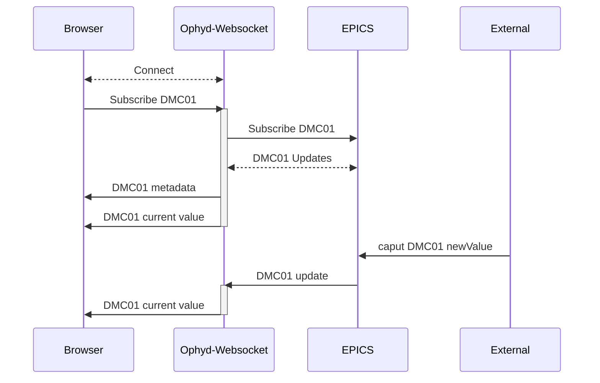

# ophyd-websocket
Experimental python based websocket used to live-monitor and set EPICS/ophyd device values through a web browser.

## Use Case 
If you are building a web browser application and need to:
* Monitor the current value of an EPICS device
* Set the value of an EPICS device
* Know immediately when an EPICS device disconnects/reconnects 

then ophyd-websocket can provide these features.

## How it works

Clients send a message to ophyd-websocket with the name of a pv. The websocket then calls EpicsSignal(your_pv) to establish a connection and provide functionality including live updates when a value changes, the device connection status changes, or to set the value. The get and set methods are utilized with ophyd.

Ophyd async is not currently supported.

A single websocket instance can hold any number of pv subscriptions.

## Demo Video

## Future plans
1. Integration with the Queue Server to avoid conflicts when the RE is active
2. Automatically instantiate connections to devices found from the Queue Server allowable devices.
3. Ophyd-async support

# Installation
``` 
git clone https://github.com/bluesky/ophyd-websocket.git 
```
Optionally set up a conda environment
```
conda create -n ophyd_websocket python=3.12
conda activate ophyd_websocket
```
Install requirements

```
#/ophyd-websocket
pip install -r requirements.txt
```

# Starting the Websocket

Start the websocket with the default host and port options
```
#/ophyd-websocket
python server/ophyd_ws_server.py
```

Start the websocket with host and port set in command line
```
#/ophyd-websocket
uvicorn server.ophyd_ws_server:app --reload --host 0.0.0.0 --port 8000
```

# Messages and Responses
